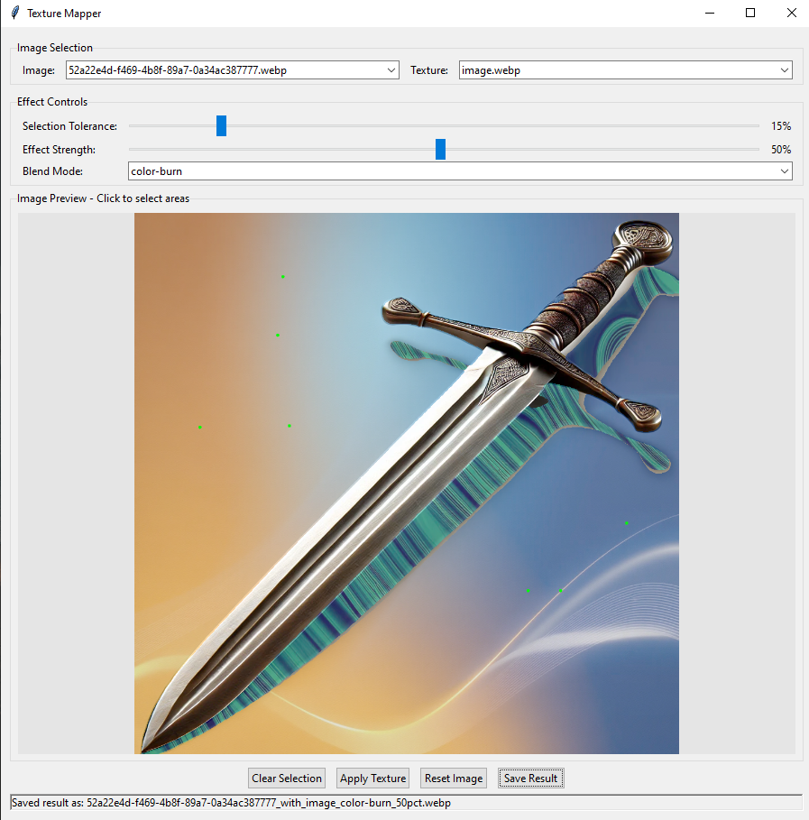
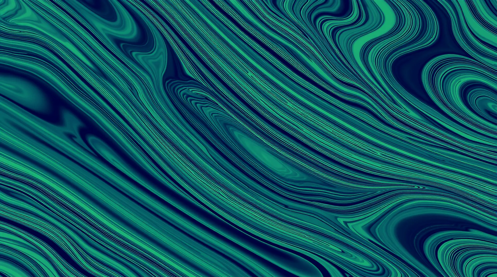

# Texture Mapper

A Python application for applying textures to selected areas of images using an intuitive GUI.



## Features

- Interactive GUI for image and texture selection
- Click-based area selection with adjustable tolerance
- Multiple blend modes for different effects
- Real-time preview of selection mask
- Progressive texture application
- Support for WebP images

## Examples

### Input Image

### Texture



### Result


## Installation

1. Clone this repository
2. Install requirements:

```bash
pip install opencv-python numpy pillow pillow-webp tk
```

3. Create necessary folders:

```bash
mkdir images textures
```

4. Place your .webp images in the `images` folder and textures in the `textures` folder

## Usage

1. Run the application:

```bash
python texture_mapper.py
```

2. Select an image and a texture from the dropdowns
3. Click on areas where you want to apply the texture
4. Adjust the tolerance and effect strength as needed
5. Choose a blend mode
6. Click "Apply Texture" to see the result
7. Save your result when satisfied

## Controls

- **Selection Tolerance**: Controls how much the selection spreads (1-100%)
- **Effect Strength**: Controls the intensity of the texture effect (1-100%)
- **Blend Mode**: Different ways to combine the texture with the original image
- **Clear Selection**: Removes selection points while preserving changes
- **Reset Image**: Returns to the original image
- **Save Result**: Saves the current result to the images/results folder

## Folder Structure

```
texture_mapper/
├── images/           # Place input images here
├── textures/        # Place texture images here
├── screenshots/     # Documentation images
├── examples/        # Example inputs and outputs
└── texture_mapper.py
```
